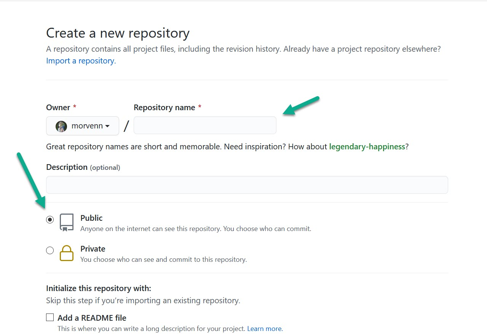
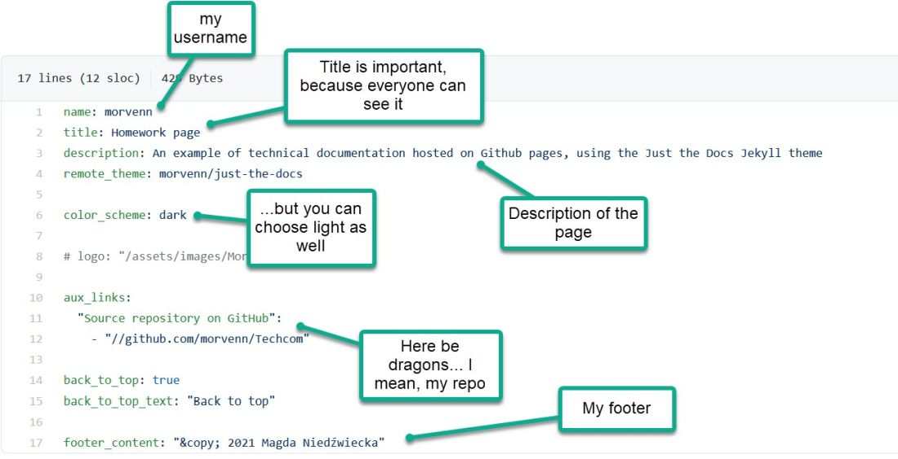

GitHub page - it's easy!
====

# Let's start

Here are the step by step instructions:

1. Create a new repository. If you don't remember how to do it, look [here](how%20to%20work%20with%20github).
2. Name your repository according to the scheme my_username.github.io. Set visibility to public.

      

3. You can click the "Add a README file" checkbox if you wish.
4. Click on "Create repository" and add the index.md file to the repository
5. And there you have it - it works! Admittedly, the page is empty for now, but we will deal with that in the next steps :-)

# Jekyll & just-the-docs 

**What is Jekyll?**

Jekyll is static page generator on GitHub. It's a part of the whole GitHub configuration. You only need to remember about Jekyll if you want to customize it.

**What is just-the-docs?**

It's one of the maaaany Jekyll themes available on GitHub. It's dedicated to create clear pages with documentation. You can find it [here](https://github.com/pmarsceill/just-the-docs).

**How to use it?**

To use Jekyll with just-the-docs theme, you should:
* have index.md in the repository
* have a _config.yml file in the repository that contains a line like this:
```
remote_theme: pmarsceill/just-the-docs
```

**Wait, what is _config.yml?**

The `_config.yml` is the main configuration file for Jekyll in your repository. It typically contains only those configuration options which are rarely changed.

The yml file can be something like this:



**Is that all?**

Basically yes, but of course it would be nice if the site had some content. So upload some .md documents to your repository, maybe some images. Upload everything to your GitHub using GitHub Desktop. 


