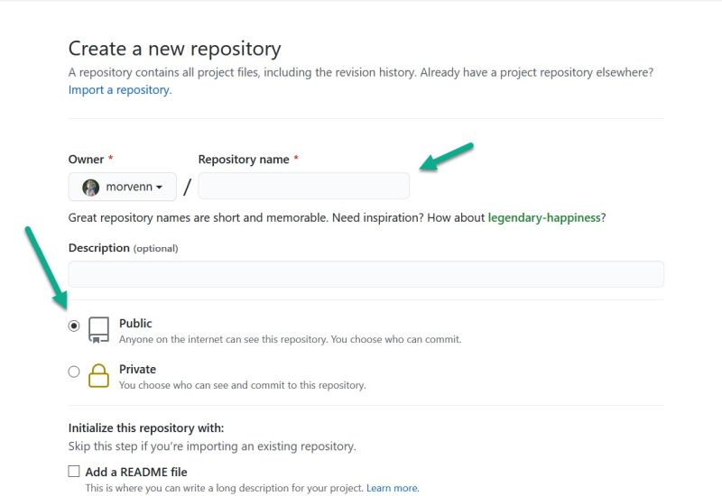

GitHub page - it's easy!
====

# Let's start

Here are the step by step instructions:

1. Create a new repository. If you don't remember how to do it, look [here](how%20to%20work%20with%20github).
2. Name your repository according to the scheme my_username.github.io. Set visibility to public.

   

