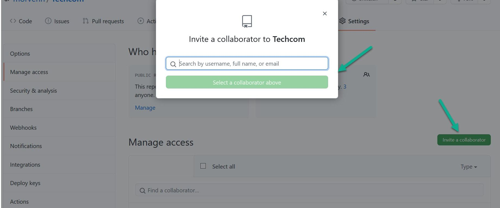

How to start your adventure with git & GitHub
======
# The beginning

To start working with git, you first need to create an account on a service like GitHub[^1]. This is similar to setting up a profile in any social media channel. Just go to:
(https://github.com/)

Then in the upper right corner click on Sign up. 

Fill in all the fields one by one (including the one that checks you are not a robot) and click on Create Account.

Congratulations, you already have a GitHub account! Now you can add a profile picture, or start following your friends. At this stage it's not much different from Facebook :-) But GitHub is not Facebook - its most important purpose is to store the pieces of your code, to share it and to work on it with other people.

# Git vs GitHub

Important: learn to distinguish between GitHub and git. Git is: 

* a kind of tool
* a version control system for code
* a way of working
* a way of thinking/operating/whatever you called it

...while GitHub is one of the places where you can upload and store the code using git commands. You can also do it using a dedicated program, for example GitHub Desktop.

# GitHub Desktop

You can download the installation version of the program from here:
(https://desktop.github.com/)
Download it, run it and follow the instructions on the screen. 

After the first run you will see the screen with welcome information. 

Now you can create a GitHub account if you haven't already done so, but you can also sign in to your GitHub account if you already have one.

When you click sign in, it launches a page in your default browser where you simply click the "Authorize desktop" button. This logs you into your GitHub account in the program. The program then asks you to set up a name and email for future code work. Click continue. You will be asked if you agree to periodically submitting usage stats for the program (which is optional). **Done!**

You are now on the "Let's get started" screen. At this point you can already start working with git, ie:

* create a tutorial repository
* clone a repository from the Internet
* create a new repository on your hard drive
* add an existing from your hard drive

# But... what exactly a repository is and how to work with it?

Let me show you it to you as ASCII art:

```
     Repository:
        |     |
     Local  Remote
     /        \
    /          \
    my disc    my GitHub <----------------
      |                                   \
      |                                    \ 
    send it using git                       \
          OR                                |
    send it using GitHub Desktop            |
          OR                                |
    send it using VS Code                   |
           |                                |
           |                                | 
    	AND FINALLY --------------------------	
```

# Create your own repo

There are two ways to do it:

1. Use GitHub Desktop: in the top menu click "file" and then "new repository".
2. Use GitHub directly: log in to your account, then click the green button "New" on the left side of the screen.

**Great!** Now you're ready to work with your brand new repository. Try to add some files there. 

And again: you can do it in at least two ways:

1. Create a file in your local disc at the same place where you keep your local repo. Then take a look into GitHub Desktop - it should detect the new file.   
2. In GitHub directly: log in to your account, then find your repository and click the button "Add file" inside of it. 

# Commit and push

It's time for the most glorious action.
If your work within the file is done, you can publish it using GitHub Desktop. Publishing is the three-step process.

1. First you have to commit your changes in your local repository. You must fill in the commit summary in GitHub Desktop (description is not obligatory). This is important - without filling in the title field, the file with the changes will not finally come to your remote repository. 

2. Then you have to push the changes to the remote repository hosted on GitHub (or wherever you keep it). If you work on the file with someone else, click "fetch origin" before push.

3. And the last step: after comitting click "push origin" button. 

# Cooperation with other GitHub users

Do you want to boast about your work? Or maybe you want to invite other GitHub users to collaborate with you or observe your friends?

1. Go to your repository on GitHub. In one of the top menus, you'll find the Settings button. Click on it. 
2. Now in the options on the left, find "Manage access". Click again - but here's a surprise, GitHub will ask you to log in again. 
3. After logging in, you will be taken to a page where you can see who already has access to your repository (if you have previously given such access to someone). **Note**: if your repository is private, you must first change it to public. If you want to add someone you want to collaborate with, click on "**Add a collaborator**". Of course, it is useful to know his/her GitHub username ;-)



*One more thing*. You may notice that on GitHub coworkers are referred to in two ways: collaborator or contributor. A collaborator is a regular contributor - someone you know and intentionally add to your list of close collaborators. A contributor, on the other hand, can be anyone who occasionally wants to improve your code. You don't have to permanently add this person to any list. 

------


[^1]: There are more services like GitHub: you can use also BitBucket, GitLab etc.